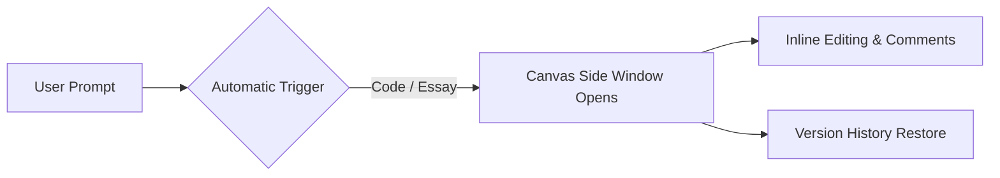

Artificial Intelligence conversational tools mein sabse badi problem yeh thi ki long-form writing ya complex coding ke dauran jab bhi aap AI se kisi specific line mein correction maangte the, toh AI poora 500 lines ka response dubara type karne lagta tha.

Is issue ko hamesha ke liye solve karne ke liye OpenAI ne **ChatGPT Canvas** launch kiya hai.

Canvas ek interactive **Side-by-Side Visual Workspace** hai jo regular chat window ke bagal mein khulta hai. Isme aap AI ke sath milkar kisi document ya code file ko ek human co-editor ki tarah edit, polish aur refactor kar sakte hain.

Is guide mein hum samjhenge ki **ChatGPT Canvas kya hai, ise kaise activate karein, aur coding & writing mein iske top features kya hain.**

---

## 📊 Quick Feature Comparison: Regular Chat vs ChatGPT Canvas vs Claude Artifacts

| Feature | Regular ChatGPT Chat | ChatGPT Canvas Workspace | Claude Artifacts |
| :--- | :--- | :--- | :--- |
| **Editing Interface** | Single Chat Stream | Side-by-Side Dual Window Editor | Standalone Side Card |
| **Code Refactoring** | Regenerates entire code block | Targeted line-by-line edits & Comments | Renders full interactive component |
| **Version Control** | Backtrack via chat history | Back/Forward Version Restore Buttons | Version dropdown tabs |
| **Inline Tools** | Text Prompts Only | Reading Level, Length Adjust, Add Logs | Code execution / Preview panel |

---

## 🚀 ChatGPT Canvas Ke Top Features (Writing & Coding)

---

### 1. Writing & Content Editing Features
- **Adjust Reading Level:** Aap 1-click mein text ki complexity (Primary School se Graduate Level tak) change kar sakte hain.
- **Adjust Length:** Document ki length ko short summary se detailed blog post tak extend ya condense kar sakte hain.
- **Add Final Polish:** Grammar, clarity aur tone ko automatically check karke professional finish deta hai.
- **Add Emojis & Formatting:** Subheadings aur relevant emojis add karne ka quick shortcut button.

---

### 2. Coding & Developer Features
- **Review Code:** Canvas aapke code mein security vulnerabilities, memory leaks aur performance bottlenecks detect karke inline comments lagata hai.
- **Add Logs & Comments:** Debugging ke liye automatically `console.log()` / print statements aur clean docstrings insert karta hai.
- **Fix Bugs:** Syntax errors aur logic bugs ko pinpoint karke correct code suggest karta hai.
- **Port to Language:** Code ko TypeScript se Python, C++, Go ya JavaScript mein instant translate karta hai.

---

## 🛠️ ChatGPT Canvas Ko Activate Aur Use Kaise Karein?

### Step-by-Step Guide:
1. Apne browser mein [chatgpt.com](https://chatgpt.com) open karein.
2. Model dropdown se **GPT-4o** select karein.
3. Chat Input bar mein naya prompt likhein (jaise: *"Write a 1000-word blog post on React 19"* ya *"Create a Python script for file compression"*).
4. System automatically detect karke right side par **Canvas Window** open kar dega.
5. (Optional Manual Trigger) Agar Canvas auto-open na ho, toh prompt ke sath `use canvas` type karein.
6. Bottom-right corner mein diye gaye **Pen Tool / Code Shortcuts** par click karke inline edits apply karein.
7. Un-do karne ke liye top bar par diye gaye **Back Arrow (History)** button par tap karein.

---

## 💡 Summary: Canvas Kab Use Karein?

* **Regular Chat Use Karein:** Quick Q&A, short translations, aur general queries ke liye.
* **Canvas Use Karein:** Long-form essays, technical documentation, multi-file code review, aur React/Python scripts refactor karne ke liye.

---

## 🎨 ChatGPT Canvas vs Claude Artifacts: Real Head-to-Head Comparison

AI workspaces ke field mein OpenAI Canvas aur Anthropic Claude Artifacts ke beech bohot tagda competition hai:

| Feature | ChatGPT Canvas (OpenAI) | Claude 3.5 Artifacts (Anthropic) |
| :--- | :--- | :--- |
| **Inline Targeted Edits** | ✅ Yes, kisi bhi particular line ko highlight karke modify karein | ❌ No, poora code block dobara re-generate hota hai |
| **Reading Level Slider** | ✅ Kindergarten se lekar Graduate level tak text simplify karein | ❌ Manual prompt instructions likhni padti hain |
| **Interactive UI Preview** | Limited to static code formatting | ✅ Live React, HTML/JS aur SVG rendering in browser |
| **Language Porting** | ✅ 1-Click Code Converter (Python, JS, C++, Go, PHP) | Manual prompt ke zariye code translate hota hai |
| **Version History** | ✅ Back & Forward revision slider available | ✅ Distinct artifact versions dropdown |

---

## 🛠️ Canvas Use Karne Ke 5 Pro Tips For Students & Coders

1. **Highlight Specific Bugs:** Poora file paste karne ke baad sirf us function ko select karein jisme error hai, aur popup mein **"Fix Bugs"** click karein.
2. **Add Inline Comments:** Agar aap naya code sikh rahe hain, toh sidebar slider se **"Add Code Comments"** select karein taaki har line ke sath Hindi explanation jud jaye.
3. **Change Document Length:** Lambe blog posts ya documentation ko short summary ya detailed technical report mein convert karne ke liye bottom-right slider use karein.
4. **Grammar & Tone Polish:** Academic research papers ko professional tone mein convert karne ke liye direct **"Polish Writing"** button dabayein.

### 🔗 Zaroori Related Articles:
* 📌 **AI Coding Tools:** Visual workspace comparison ke liye hamara [Cursor vs GitHub Copilot Guide](/blog/cursor-vs-copilot-best-ai-coding-assistant/) padhein.
* 📌 **Local LLMs:** PC par offline AI chalane ke liye [DeepSeek & Ollama Windows Setup](/blog/deepseek-locally-windows-11-ollama-guide/) check karein.
