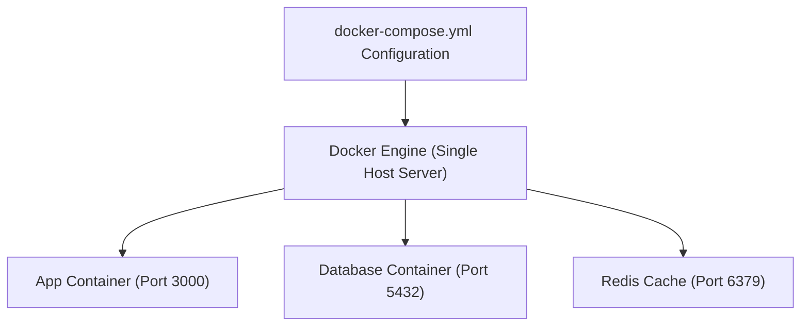
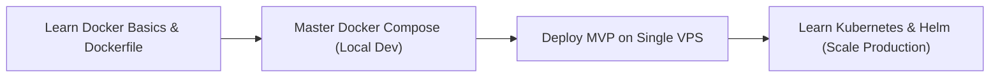

Modern Cloud-Native application architecture mein monolithic applications ko **Microservices** mein break kar diya gaya hai. Ab ek single web app ke pichhe 5-10 alag-alag containers run hote hain: **Node.js Frontend, Python AI Service, PostgreSQL Database, Redis Cache, aur Nginx Reverse Proxy**.

In multiple containers को ek sath spin up, network connect, aur production server par deploy karne ke liye do main tools use hote hain: **Docker Compose** aur **Kubernetes (K8s)**.

Is beginner-friendly guide mein hum simple Hinglish mein samjhenge ki **Docker Compose aur Kubernetes kaise kaam karte hain, dono ke differences kya hain, aur aapke DevOps & Web Dev career ke liye 2026 mein kaun sa chunein.**

---

## 📊 Technical Comparison Matrix: Docker Compose vs Kubernetes

| Parameter | Docker Compose | Kubernetes (K8s) |
| :--- | :--- | :--- |
| **Primary Scope** | Single-Host Container Orchestration | Multi-Node Distributed Cluster Orchestration |
| **Setup Complexity** | Simple & Fast (Single YAML File) | High Learning Curve (Control Plane, Worker Nodes, Pods) |
| **Auto-Scaling** | ❌ No Native Auto-scaling | ✅ Automated Horizontal Pod Autoscaling (HPA) |
| **Self-Healing** | Limited (Basic container restart policy) | ✅ Advanced (Dead pods replace, health probes) |
| **Zero-Downtime Deployment** | Manual Rolling Swap | ✅ Automated Rolling Updates & Blue-Green Deployments |
| **Best Used For** | Local Development, Staging, Simple VPS (DigitalOcean / EC2) | Enterprise Production Clusters (AWS EKS, Google GKE, Azure AKS) |

---

## 🐳 1. Docker Compose Samjhein (Single-Host YAML)

Docker Compose ek lightweight tool hai jo single `docker-compose.yml` file se aapke saare containers, environment variables, networks aur volumes ko bind kar deta hai.



### Sample `docker-compose.yml`:
```yaml
version: '3.8'

services:
  web:
    build: .
    ports:
      - "3000:3000"
    environment:
      - DB_HOST=db
    depends_on:
      - db

  db:
    image: postgres:16-alpine
    environment:
      POSTGRES_PASSWORD: mysecretpassword
    volumes:
      - postgres_data:/var/lib/postgresql/data

volumes:
  postgres_data:
```

- **Fayda:** Local machine par `docker compose up` likhte hi saara stack 5 second mein start ho jata hai.
- **Limitation:** Agar aapka server crash ho gaya ya traffic 100x badh gaya, toh Docker Compose akele doosre server par containers scale nahi kar sakta.

---

## ☸️ 2. Kubernetes (K8s) Samjhein (Multi-Node Cluster)

Kubernetes Google dwara open-source kiya gaya ek **Production-Grade Container Orchestration Engine** hai.

### Core K8s Building Blocks:
- **Pod:** Kubernetes ka smallest deployable unit (ek ya do containers ka group).
- **Deployment:** Pods ke count (replicas) aur rolling updates ko manage karta hai.
- **Service:** Pods ko static IP aur Internal Load Balancer assign karta hai.
- **Ingress:** External HTTP/HTTPS traffic ko cluster ke andar route karta hai.

```yaml
# Sample Kubernetes Deployment Manifest
apiVersion: apps/v1
kind: Deployment
metadata:
  name: web-app-deployment
spec:
  replicas: 3 # Run 3 identical copies across servers
  selector:
    matchLabels:
      app: web-app
  template:
    metadata:
      labels:
        app: web-app
    spec:
      containers:
      - name: node-app
        image: mycompany/node-app:v1.2
        ports:
        - containerPort: 3000
```

---

## 🎯 Final Decision Roadmap: 2026 Mein Kya Sikhein?



1. **Step 1:** Pehle Docker Containerization aur `docker-compose` master karein. Local development mein 90% times yahi use hoga.
2. **Step 2:** Jab aapki Web App par heavy traffic aaye aur multi-server production deployment (AWS EKS / GKE) ki zaroorat ho, tab Kubernetes, K3s, aur Helm charts par shift hon.

---

## 📊 Feature by Feature Detailed Comparison Matrix

Agar aap production architecture design kar rahe hain, toh in dono tools ke core technical difference ko samajhna behad zaroori hai:

| Technical Feature | Docker Compose | Kubernetes (K8s) |
| :--- | :--- | :--- |
| **Architecture Scope** | Single Host (Single VPS ya Laptop) | Multi-Node Cluster (Dozens/Hundreds of Servers) |
| **Auto-Scaling (HPA)** | ❌ Manual (`docker compose up --scale`) | ✅ Built-in Horizontal Pod Autoscaler based on CPU/RAM |
| **Self-Healing** | Limited (`restart: always`) | ✅ Advanced (Liveness/Readiness probes, automatic pod restarts) |
| **Traffic Load Balancing** | Host port mapping ya Nginx reverse proxy | ✅ Built-in Internal Service mesh & Ingress controllers |
| **Secret Management** | `.env` files ya local volume binds | ✅ Native encrypted K8s Secrets & ConfigMaps |
| **Production Cost** | Extremely low (Starts from ₹400/month VPS) | Medium to High (Managed EKS/GKE cluster minimum ₹5,000+/mo) |
| **Learning Curve** | 1 Se 2 Din (Super Beginner Friendly) | 2 Se 4 Mahine (Enterprise Level Complexity) |

---

## 💡 Real-World Production Scenarios: Kab Kya Chunna Chahiye?

1. **Docker Compose Kab Best Hai?**
   * **Side Projects & Freelance MVPs:** Agar aap Next.js frontend, Node.js backend aur PostgreSQL database run kar rahe hain jisme daily 10k-50k users aate hain, toh ek single 4GB RAM wale Hetzner ya DigitalOcean droplet par Docker Compose rock-solid chalta hai.
   * **Staging & Local CI/CD:** Developers ki local machine par exact replica database aur cache spin up karne ke liye Compose se tez koi tool nahi hai.

2. **Kubernetes Kab Zaroori Ho Jata Hai?**
   * **Zero Downtime Deployments:** Jab aap din mein 10 baar production deploy karte hain aur ek second ke liye bhi traffic break nahi hona chahiye (Canary / Blue-Green deployments).
   * **Multi-Cloud High Availability:** Agar AWS ka ek poora data center down ho jaye, toh K8s automatically doosre availability zone mein pods migrate kar deta hai.


### 🔗 Zaroori Related Articles:
* 📌 **Docker Basics:** Beginner Docker installation ke liye hamara [Docker Beginners Guide in Hindi](/blog/docker-beginners-guide-hindi-web-development/) padhein.
* 📌 **DevOps Roadmap:** Full stack deployment guide ke liye [Full Stack Developer Roadmap 2026](/blog/full-stack-developer-kaise-bane-2026-roadmap/) check karein.
