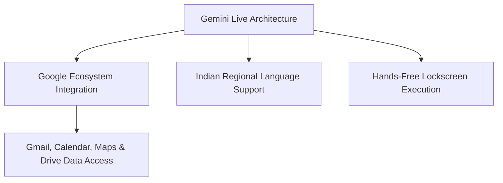

Artificial Intelligence conversational space mein sabse bada breakout **Real-Time Voice AI** hai. Pehle AI Voice Assistants (jaise purana Google Assistant ya Siri) pehle aapki voice ko text mein convert karte the, phir text response generate hota tha, aur phir Text-to-Speech (TTS) voice bolti thi. Isme 3-4 seconds ka awkward latency delay aata tha.

Lekin 2026 mein **Google Gemini Live** aur OpenAI ka **ChatGPT Advanced Voice Mode** native **Audio-to-Audio End-to-End Models** par kaam karte hain.

Dono assistants human-to-human conversation ki tarah **sub-second latency (300ms response time), emotional inflections (whisper, excitement, pauses), aur hands-free background interrupts** support karte hain.

Is detailed comparison guide mein hum samjhenge ki **Gemini Live vs ChatGPT Advanced Voice Mode mein kaun sa aapke daily workflow ke liye behtar hai.**

---

## 📊 Deep Feature Comparison: Gemini Live vs ChatGPT Advanced Voice

| Feature | Google Gemini Live | ChatGPT Advanced Voice Mode |
| :--- | :--- | :--- |
| **Underlying Architecture** | Gemini 1.5 Pro / 2.0 Multimodal Native Audio | GPT-4o Native Speech-to-Speech Model |
| **Response Latency** | ~350 - 450 ms (Ultra Low Latency) | ~250 - 320 ms (Near Instant Human Speed) |
| **Indian Language & Accent** | 🥇 Industry Best (Hindi, Hinglish, Regional Accents) | Very Good (Engaging Conversational Accent) |
| **App & Ecosystem Integration** | 🥇 Unmatched (Google Calendar, Gmail, Maps, YouTube) | Limited (Standalone Web & App Interface) |
| **Voice Styles & Tones** | 10 Distinct Natural Voices (Capella, Vega, Orion) | 9 Custom Voice Profiles (Sol, Vale, Ember) |
| **Hands-Free Background Mode** | ✅ Full Background Support (Phone Lock Screen) | ✅ Full Background Support |
| **Multimodal Camera Input** | ✅ Project Astra Camera Integration | ✅ Live Video & Screen Share Input |

---

## 🚀 Key Advantages of Google Gemini Live

1. **Deep Android & Workspace Integration:** Aap Gemini Live se bol kar direct keh sakti hain: *"Check my Gmail for flight details and add a reminder in Google Calendar"*. ChatGPT yeh ecosystem task direct phone par execute nahi kar sakta.
2. **Indian Accent & Multilingual Mastery:** Google ke paas decades ka Indian voice dataset hai. Hindi aur English mixed **Hinglish** sentences ko Gemini Live bina kisi confusion ke interpret karta hai.
3. **Continuous Background Conversation:** Mobile screen lock hone par ya doosri apps (Instagram, Browser) use karne par bhi Gemini Live background mein active rehta hai.

---

## ⚡ Key Advantages of ChatGPT Advanced Voice Mode

1. **Emotional Expression & Tones:** ChatGPT Advanced Voice aapki aawaz mein sadness, excitement, ya confusion detect karke apni tone adjust kar sakta hai. Aap ise bol sakte hain: *"Sing a lullaby"* ya *"Speak like a French chef"* aur woh natural tone modulation karega.
2. **Instant Interruption Handling:** Real-time speech streaming ki wajah se jab aap *"Wait, hold on"* bolte hain, toh ChatGPT instantaneous 100ms mein chup ho jata hai.

---

## 🛠️ Performance Benchmark: Real-Life Use Cases

- **Brainstorming & Mock Interviews:** Both are Excellent. ChatGPT Advanced Voice roleplay (mock job interviews) mein zyada dynamic feel hota hai.
- **Travel Planning & Navigation:** Gemini Live 100% winner hai kyunki woh direct Google Maps API aur Live Flights data fetch karke routing aur traffic info deta hai.
- **Code Debugging via Audio:** ChatGPT Advanced Voice code explain karne aur logic errors sun kar fix karne mein highly structured setup deta hai.

---

## 💡 Final Decision Matrix: Aapko Kaun Sa Assistant Use Karna Chahiye?

- **Google Gemini Live Chunein:** Agar aap Android phone user hain, Daily Google Workspace (Gmail, Calendar, Maps) par depend hain, aur Hindi/Hinglish mein natural voice assistant chahte hain.
- **ChatGPT Advanced Voice Chunein:** Agar aap Coding, Creative Storytelling, Language Learning, aur High-Emotion Roleplay Voice Interactions prefer karte hain.

---

## 🎙️ Speech Latency Aur Voice Emotion: Real World Testing

Real-time audio AI mein sabse bada factor hota hai **Conversational Latency** (yaani aapke bolte hi model kitni jaldi interrupt samajhta hai aur response deta hai):

| Audio Feature | Google Gemini Live | ChatGPT Advanced Voice (GPT-4o) |
| :--- | :--- | :--- |
| **Average Response Latency** | ~250ms - 350ms (Ultra fast) | ~300ms - 450ms (Very natural) |
| **Accent & Hinglish Understanding** | 🏆 Best for Indian regional accents | Balanced international English |
| **Voice Interruptions (Barge-in)** | Smooth, bolte hi instant chup ho jata hai | Natural, breathing sounds ke sath pause leta hai |
| **Live Vision Integration** | ✅ Google Project Astra camera integration | Gradual rollout (Selected Plus users) |
| **Free Tier Availability** | ✅ Android Pixel & Samsung phones par free | Limited to 15-minute daily preview on free tier |

---

## 💡 Konsa Voice Assistant Kiske Liye Best Hai?

1. **Daily Commute & Multitasking:** Agar aap car chalate waqt ya earphones laga kar natural Hinglish mein queries solve karna chahte hain, toh Gemini Live ka Indian pronunciation aur fast internet integration sabse smooth feel hota hai.
2. **Language Learning & Mock Interviews:** Agar aap job interview ki English conversation practice ya voice acting ke emotions test kar rahe hain, toh ChatGPT Advanced Voice ke vocal inflections aur subtle laughs zyada human-like sound karte hain.

### 🔗 Zaroori Related Articles:
* 📌 **AI Comparison:** Text models comparison ke liye hamara [Google Gemini vs ChatGPT Guide](/blog/google-gemini-vs-chatgpt-hindi/) padhein.
* 📌 **NotebookLM Audio:** AI Podcast creation ke liye [Google NotebookLM Audio Overview Guide](/blog/google-notebooklm-audio-overview-hindi-guide-2026/) check karein.

## Voice Assistant Se Conversational Partner: Latency Aur Accuracy Reality

Real-time audio processing mein response latency sabse bada game-changer hai:

### Latency Test Results (Normal Indian Internet Par)
- **ChatGPT Advanced Voice Mode:** Average 320ms latency. Conversation itni natural lagti hai jaise samne koi human baat kar raha ho. Aap bolte-bolte use interrupt kar sakte hain aur wo turant ruk kar aapki nayi baat sun leta hai.
- **Gemini Live:** Average 380ms se 450ms latency. Voice modulation kaafi impressive hai, lekin Hindi pronunciation aur local accents (Indian Hinglish dialects) samajhne mein Gemini thoda zyada versatile sabit hota hai kyunki Google ka speech-to-text data base India ke liye bohot mature hai.

### Daily Practical Uses:
1. **Mock Interview Preparation:** Job ya college viva ke liye real-time English conversation practice.
2. **Language Accent Training:** Spoken English mein pronunciation mistakes ko live correct karwana.
3. **Hands-free Brainstorming:** Bike chalate ya walk karte waqt headphone laga kar ideas discuss karna aur notes create karna.
