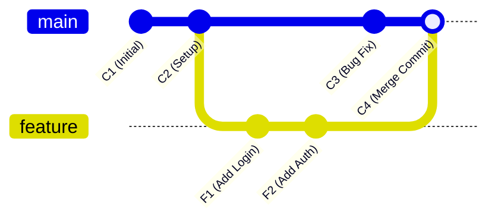
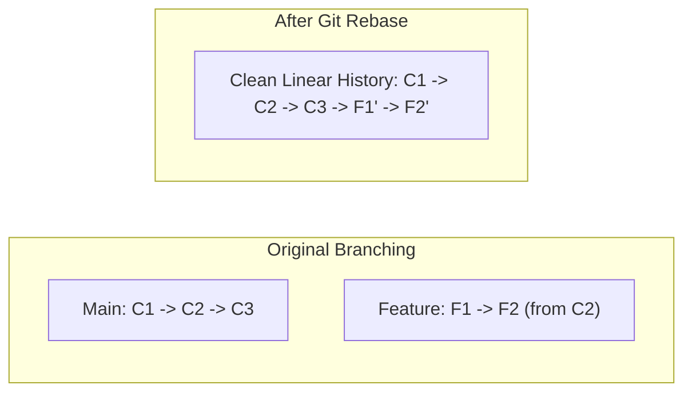

Web Development aur Software Engineering teams mein Jab multiple developers ek hi project repository par kaam karte hain, toh feature branches ko main branch mein combine karne ke liye do main tools use hote hain: **Git Merge** aur **Git Rebase**.

Naye developers aur computer science students ke beech `git merge` vs `git rebase` sabse confusing topic rehta hai.

Is detailed tutorial mein hum visual diagrams, terminal examples aur simple Hinglish ke zariye samjhenge ki **Git Merge aur Git Rebase kaise kaam karte hain, dono ke fayde-nuksaan kya hain, aur kab kaun sa command run karna chahiye.**

---

## 📊 Quick Summary Table: Git Merge vs Git Rebase

| Parameter | Git Merge | Git Rebase |
| :--- | :--- | :--- |
| **Commit History Structure** | Non-Linear (Diamond / Web branch graph) | Clean & Linear (Single straight line graph) |
| **Merge Commit Creation** | ✅ Naya Merge Commit create hota hai (3-way merge) | ❌ Koi naya merge commit nahi banta |
| **Original Commit Hashes** | Preserves original commit hashes and timestamps | Rewrites commit history with new SHA-1 hashes |
| **Conflict Resolution** | Single conflict resolution step during merge | Resolves conflicts commit-by-commit sequentially |
| **Team Best Practice** | Safe for Shared Public Branches (`main`, `dev`) | Best for Local Feature Cleanups before Pull Request |

---

## 🔀 Strategy 1: Git Merge Samjhein

`git merge` aapki feature branch ke saare history ko `main` branch mein integrate karta hai ek naye **3-Way Merge Commit** ke zariye.



### Terminal Commands:
```bash
# Main branch par switch karein
git checkout main

# Feature branch ko merge karein
git merge feature-login
```

- **Fayda:** Yeh non-destructive hota hai. Project ki true chronological history safely preserve rehti hai.
- **Nuksaan:** Jab 10+ developers roz merge karte hain, toh Git Graph boht messy aur complex (Spaghetti graph) dikhne lagta hai.

---

## ⚡ Strategy 2: Git Rebase Samjhein

`git rebase` aapke feature branch ke commits ko temporary nikal kar `main` branch ke latest commit ke aage **"Re-Base" (Re-Attach)** kar deta hai, jaise feature branch abhi-abhi main ke latest commit se shuru hui ho.



### Terminal Commands:
```bash
# Feature branch par jayein
git checkout feature-login

# Main branch ke aage rebase karein
git rebase main

# Ab main branch par jaakar fast-forward merge karein
git checkout main
git merge feature-login
```

- **Fayda:** Project commit history ekdum clean linear line mein dikhti hai. `git log` padhna aasan ho jata hai.
- **Nuksaan:** Commit hashes rewrite ho jate hain. Misuse karne par branch sync bigad sakta hai.

---

## 🚨 The Golden Rule of Git Rebase (Boht Zaroori!)

> **⚠️ Never Rebase a Public Branch!**
> 
> Kisi bhi aisi branch ko kabhi rebase na karein jo GitHub/GitLab par pushed hai aur jisme team ke doosre developers kaam kar rahe hain. 

- **SAFI USAGE:** Sirf apne **local personal feature branch** par rebase karein PR (Pull Request) open karne se pehle.
- **SHARED BRANCHES:** Shared `main`, `master`, ya `staging` branches par hamesha `git merge` ka hi use karein.

---

## 🛠️ Pro Tip: Interactive Rebase (`git rebase -i`)

Pull request review ke liye bhejne se pehle apne 10 chote-chote messy commits (jaise *"fix typo"*, *"wip"*, *"test"*) ko 1 clean commit mein milane (Squash) ke liye:

```bash
# Pichle 4 commits ko interactively edit karein
git rebase -i HEAD~4
```

Editor screen par commit ke aage `pick` ko `squash` (ya `s`) karke save karein. Saare commits Combine ho jayenge!

---

## ⚠️ The Golden Rule of Git Rebase (Jo Har Developer Ko Pata Honi Chahiye)

Git Rebase ka sabse bada khatra yeh hai ki yeh **commit history ko rewrite karta hai** (purane commits ki SHA hash IDs badal jaati hain).

> 🚨 **NEVER REBASE A PUBLIC SHARED BRANCH!**
> Kabhi bhi `main`, `master` ya production shared branch par rebase na chalayein. Agar doosre developers ne purane commits ke upar naya code pull kiya hua hai, toh rebase chalane se unka local git tree corrupt ho jayega aur catastrophic merge conflicts aayenge.

### Kab Kaun Sa Command Run Karein? (Cheat Sheet)

* **Feature Branch Ko Update Rakhne Ke Liye:**
  ```bash
  git checkout my-feature-branch
  git fetch origin
  git rebase origin/main
  ```
* **Feature Branch Ko Main Mein Merge Karne Ke Liye:**
  ```bash
  git checkout main
  git merge --no-ff my-feature-branch
  ```

Is hybrid workflow se aapka feature branch clean rehta hai aur main repository par complete traceable merge commit history maintain hoti hai.


### 🔗 Zaroori Related Articles:
* 📌 **Git Basics:** Beginners git concepts ke liye hamara [Git & GitHub Guide in Hindi](/blog/git-and-github-beginners-guide-hindi/) padhein.
* 📌 **Git Errors:** Push rejection solve karne ke liye [Git Push Rejected Fix](/blog/git-push-rejected-error-solution-hindi/) check karein.
