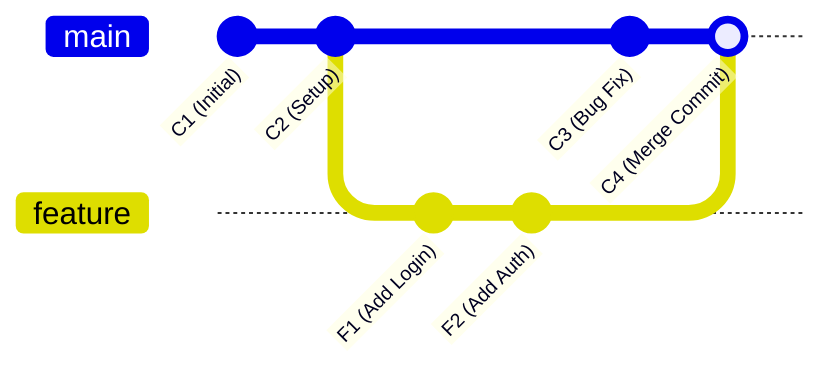
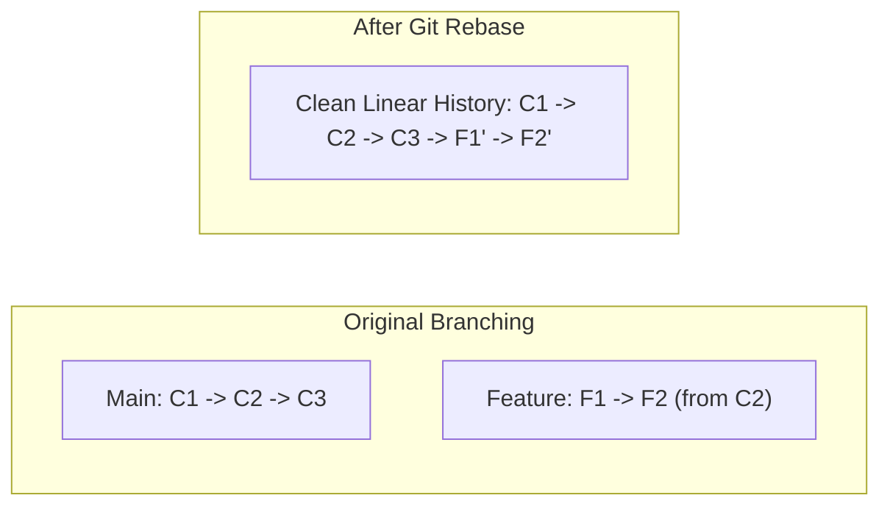

Web Development aur Software Engineering teams mein Jab multiple developers ek hi project repository par kaam karte hain, toh feature branches ko main branch mein combine karne ke liye do main tools use hote hain: **Git Merge** aur **Git Rebase**.

Naye developers aur computer science students ke beech `git merge` vs `git rebase` sabse confusing topic rehta hai.

Is detailed tutorial mein hum visual diagrams, terminal examples aur simple Hinglish ke zariye samjhenge ki **Git Merge aur Git Rebase kaise kaam karte hain, dono ke fayde-nuksaan kya hain, aur kab kaun sa command run karna chahiye.**

---

## 📊 Quick Summary Table: Git Merge vs Git Rebase

| Parameter | Git Merge | Git Rebase |
| :--- | :--- | :--- |
| **Commit History Structure** | Non-Linear (Diamond / Web branch graph) | Clean & Linear (Single straight line graph) |
| **Merge Commit Creation** | ✅ Naya Merge Commit create hota hai (3-way merge) | ❌ Koi naya merge commit nahi banta |
| **Original Commit Hashes** | Preserves original commit hashes and timestamps | Rewrites commit history with new SHA-1 hashes |
| **Conflict Resolution** | Single conflict resolution step during merge | Resolves conflicts commit-by-commit sequentially |
| **Team Best Practice** | Safe for Shared Public Branches (`main`, `dev`) | Best for Local Feature Cleanups before Pull Request |

---

## 🔀 Strategy 1: Git Merge Samjhein

`git merge` aapki feature branch ke saare history ko `main` branch mein integrate karta hai ek naye **3-Way Merge Commit** ke zariye.



### Terminal Commands:
```bash
# Main branch par switch karein
git checkout main

# Feature branch ko merge karein
git merge feature-login
```

- **Fayda:** Yeh non-destructive hota hai. Project ki true chronological history safely preserve rehti hai.
- **Nuksaan:** Jab 10+ developers roz merge karte hain, toh Git Graph boht messy aur complex (Spaghetti graph) dikhne lagta hai.

---

## ⚡ Strategy 2: Git Rebase Samjhein

`git rebase` aapke feature branch ke commits ko temporary nikal kar `main` branch ke latest commit ke aage **"Re-Base" (Re-Attach)** kar deta hai, jaise feature branch abhi-abhi main ke latest commit se shuru hui ho.



### Terminal Commands:
```bash
# Feature branch par jayein
git checkout feature-login

# Main branch ke aage rebase karein
git rebase main

# Ab main branch par jaakar fast-forward merge karein
git checkout main
git merge feature-login
```

- **Fayda:** Project commit history ekdum clean linear line mein dikhti hai. `git log` padhna aasan ho jata hai.
- **Nuksaan:** Commit hashes rewrite ho jate hain. Misuse karne par branch sync bigad sakta hai.

---

## 🚨 The Golden Rule of Git Rebase (Boht Zaroori!)

> **⚠️ Never Rebase a Public Branch!**
> 
> Kisi bhi aisi branch ko kabhi rebase na karein jo GitHub/GitLab par pushed hai aur jisme team ke doosre developers kaam kar rahe hain. 

- **SAFI USAGE:** Sirf apne **local personal feature branch** par rebase karein PR (Pull Request) open karne se pehle.
- **SHARED BRANCHES:** Shared `main`, `master`, ya `staging` branches par hamesha `git merge` ka hi use karein.

---

## 🛠️ Pro Tip: Interactive Rebase (`git rebase -i`)

Pull request review ke liye bhejne se pehle apne 10 chote-chote messy commits (jaise *"fix typo"*, *"wip"*, *"test"*) ko 1 clean commit mein milane (Squash) ke liye:

```bash
# Pichle 4 commits ko interactively edit karein
git rebase -i HEAD~4
```

Editor screen par commit ke aage `pick` ko `squash` (ya `s`) karke save karein. Saare commits Combine ho jayenge!

---

## ⚠️ The Golden Rule of Git Rebase (Jo Har Developer Ko Pata Honi Chahiye)

Git Rebase ka sabse bada khatra yeh hai ki yeh **commit history ko rewrite karta hai** (purane commits ki SHA hash IDs badal jaati hain).

> 🚨 **NEVER REBASE A PUBLIC SHARED BRANCH!**
> Kabhi bhi `main`, `master` ya production shared branch par rebase na chalayein. Agar doosre developers ne purane commits ke upar naya code pull kiya hua hai, toh rebase chalane se unka local git tree corrupt ho jayega aur catastrophic merge conflicts aayenge.

### Kab Kaun Sa Command Run Karein? (Cheat Sheet)

* **Feature Branch Ko Update Rakhne Ke Liye:**
  ```bash
  git checkout my-feature-branch
  git fetch origin
  git rebase origin/main
  ```
* **Feature Branch Ko Main Mein Merge Karne Ke Liye:**
  ```bash
  git checkout main
  git merge --no-ff my-feature-branch
  ```

Is hybrid workflow se aapka feature branch clean rehta hai aur main repository par complete traceable merge commit history maintain hoti hai.


### 🔗 Zaroori Related Articles:
* 📌 **Git Basics:** Beginners git concepts ke liye hamara [Git & GitHub Guide in Hindi](/blog/git-and-github-beginners-guide-hindi/) padhein.
* 📌 **Git Errors:** Push rejection solve karne ke liye [Git Push Rejected Fix](/blog/git-push-rejected-error-solution-hindi/) check karein.

## Git Cherry-Pick — Selective Commits का जादू

कभी ऐसा हुआ कि किसी दूसरे branch पर एक specific commit है जो तुम्हें अपनी branch में चाहिए — पर पूरा branch merge नहीं करना? यही काम **cherry-pick** करता है।

### Cherry-Pick कब Use करें?

- Hotfix किसी दूसरे branch पर था, उसे production में लाना हो
- Teammate ने एक useful utility function commit किया जो अभी तुम्हें चाहिए
- Experimental branch से कोई specific feature लेना हो

### Example — Commands के साथ

```bash
# पहले commit hash ढूंढो जो चाहिए
git log --oneline feature/payment-module

# Output:
# a3f9c12 Add UPI payment support
# b7e1d34 Fix validation bug
# c0d2a11 Initial payment setup

# सिर्फ UPI payment commit को current branch में लाओ
git cherry-pick a3f9c12

# Multiple commits cherry-pick करने हों तो
git cherry-pick a3f9c12 b7e1d34

# Conflict आए तो resolve करके
git cherry-pick --continue

# गड़बड़ हो गई? वापस जाओ
git cherry-pick --abort
```

> **याद रखो:** Cherry-pick एक new commit बनाता है same changes के साथ — original commit hash change हो जाती है।

---

## Git Stash — काम बीच में छोड़ना हो तो

Boss ने बोला "अभी production bug fix करो" और तुम्हारा आधा feature incomplete है — घबराओ नहीं, **git stash** है ना!

### Basic Stash Commands

```bash
# Current changes temporarily save करो
git stash

# या meaningful name के साथ (recommended!)
git stash save "login form validation wip"

# सभी stashes देखो
git stash list
# Output:
# stash@{0}: On main: login form validation wip
# stash@{1}: On feature/ui: navbar responsive fix

# Latest stash वापस लाओ और list से हटाओ
git stash pop

# Stash वापस लाओ लेकिन list में रहने दो
git stash apply

# Specific stash apply करो
git stash apply stash@{1}

# Stash delete करना हो
git stash drop stash@{0}

# सारे stashes एक साथ clean करो
git stash clear
```

### Pop vs Apply — Difference

| Command | Stash List से हटता है? | Use Case |
|---|---|---|
| `git stash pop` | ✅ हाँ | Single use — एक बार apply करके done |
| `git stash apply` | ❌ नहीं | Multiple branches पर same changes apply करने हों |

---

## Git Log को Visualize करो

Plain `git log` boring और overwhelming होता है। इस command से tree जैसा view मिलेगा:

```bash
# Clean one-line graph view
git log --oneline --graph --all

# Output कुछ ऐसा दिखेगा:
# * a3f9c12 (HEAD -> main) Fix payment bug
# | * b7e1d34 (feature/dashboard) Add analytics chart
# |/
# * c0d2a11 Merge PR #42 - Auth module
# * d1e3f56 Initial commit
```

### Alias Setup — Shortcut बनाओ

हर बार यह लंबा command type करना painful है। एक बार alias set करो:

```bash
# Git config में alias add करो
git config --global alias.lg "log --oneline --graph --all --decorate"

# अब बस इतना type करो
git lg
```

Decorate flag branches और tags के नाम भी दिखाता है — बहुत helpful।

---

## Real-World Team Workflow Example

यह है एक practical team workflow जो most startups follow करते हैं:

### Feature Branch Workflow with Rebase

```bash
# Step 1: Main से fresh feature branch बनाओ
git checkout main
git pull origin main
git checkout -b feature/user-profile

# Step 2: काम करो, commits करो
git add .
git commit -m "feat: add profile avatar upload"
git commit -m "feat: add bio edit functionality"

# Step 3: PR raise करने से पहले — main के साथ sync करो
git fetch origin
git rebase origin/main

# Rebase के दौरान conflict आए तो:
# 1. File manually fix करो
git add resolved-file.js
git rebase --continue

# Step 4: Clean history के साथ push करो
git push origin feature/user-profile --force-with-lease

# Step 5: GitHub/GitLab पर PR open करो
# Team review करे, approve करे

# Step 6: Merge — Squash merge preferred for clean history
# (GitHub पर "Squash and Merge" button use करो)
```

### Merge Strategy Summary

| Strategy | History | Use Case |
|---|---|---|
| **Merge Commit** | Branch history preserve | Long-running features |
| **Squash & Merge** | Clean single commit | Short features, bug fixes |
| **Rebase & Merge** | Linear history | Open source projects |

**Golden Rule:** Team में एक strategy decide करो और consistently follow करो। Mixed strategies से history messy हो जाती है और `git blame` useless हो जाता है। 🎯
