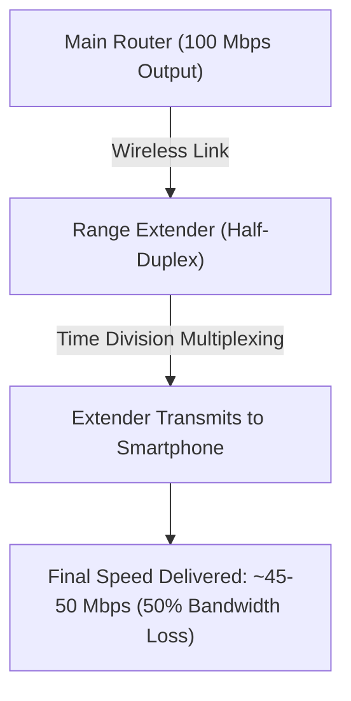

Ghar mein 200Mbps ya 300Mbps ka Fiber Broadband Connection hone ke bawajood jab aap bedroom, balcony ya upper floor par jate hain, toh Wi-Fi signals single bar ho jate hain aur video calls buffering karne lagti hain. Is problem ko **Wi-Fi Dead Zone** kehate hain.

Wi-Fi coverage badhane ke do main tarike hain: **Wi-Fi Range Extender (Repeater)** aur **Mesh Wi-Fi System**.

Boht se log sasta samjh kar ₹1,200 ka Range Extender khareed lete hain aur baad mein speed drops aur frequent disconnection se pareshan hote hain.

Is detailed guide mein hum samjhenge ki **Mesh Wi-Fi vs Range Extender mein kya technical differences hain aur aapke ghar ke layout ke liye kaun sa sahi rahega.**

---

## 📊 Technical Comparison: Mesh Wi-Fi vs Range Extender

| Parameter | Traditional Wi-Fi Range Extender | Mesh Wi-Fi System (TP-Link Deco / Netgear Orbi) |
| :--- | :--- | :--- |
| **Network Name (SSID)** | 2 Separate SSIDs (`Home_WiFi` & `Home_WiFi_EXT`) | Single Unified Network Name (`Home_WiFi`) |
| **Roaming Experience** | Manual Reconnect (Phone purane weak signal ko pakde rehta hai) | 802.11k/v/r Seamless Auto-Switching |
| **Bandwidth & Speed Loss** | 30% - 50% Speed Reduction | Full Bandwidth Preservation (Dedicated Backhaul) |
| **Network Management** | Individual Web Portal Configuration | Centralized Mobile App Management |
| **Setup Cost** | Budget Friendly (₹1,200 - ₹2,500) | Mid-to-High Range (₹4,500 - ₹15,000) |
| **Best Suited For** | 1-2 Room Apartments (Single Dead Spot) | Multi-story Houses, Large Apartments (3BHK/4BHK) |

---

## ⚡ Wi-Fi Extender Speed Drop Ka Technical Reason

Standard Range Extender router ke wireless signal ko catch karke aage repeat karta hai. Kyunki extender ke paas single transmitter antenna hota hai:
1. Time-slot 1 mein woh main router se data receive karta hai.
2. Time-slot 2 mein woh wahi data aapke mobile ko bhejta hai.

Is **Half-Duplex Time Division** ki wajah se extender ke dwara milne wali internet speed flat 50% drop ho jaati hai.

---

## 🌐 Mesh Wi-Fi Seamless Roaming Kaise Kaam Karta Hai?

Mesh System mein 2 ya 3 identical satellite nodes hote hain jo poore ghar mein ek mesh grid bana dete hain:
- **Dedicated Wireless Backhaul:** Tri-band Mesh systems (2.4GHz + 5GHz-1 + 5GHz-2) mein ek 5GHz frequency band sirf nodes ke beech internal data transfer ke liye reserve rehti hai. Isse aapko balcony mein bhi full 200Mbps speed milti hai.
- **802.11r Fast BSS Transition:** Jab aap ground floor se 1st floor par jate hain, toh mesh system 10 milliseconds ke andar aapki connection ko nearest node par handoff kar deta hai bina WhatsApp call drop hue.

---

## 💡 Buyer Decision Guide: Aapko Kya Kharidna Chahiye?

### 1. Wi-Fi Range Extender Kharidein Agar:
- Aapka ghar **1BHK ya 2BHK** apartment hai.
- Sirf ek specific corner ya balcony mein signal weak aata hai.
- Aapka internet plan **50Mbps se kam** hai aur budget tight (under ₹2,000) hai.

### 2. Mesh Wi-Fi System Kharidein Agar:
- Aapka ghar **3BHK+, Duplex, ya Multi-Story House** hai.
- Aapke ghar mein 15+ smart home devices, Smart TVs aur laptops connected rehte hain.
- Aap 100Mbps - 1Gbps Fiber Broadband plan use karte hain aur ghar ke har kone mein full speed chahte hain.

---

## 📶 Handover Roaming Reality: Extender Kyu Fail Ho Jaata Hai?

Jab aap Wi-Fi Range Extender use karte hain, toh ghar mein do alag-alag network ban jaate hain:
* Living Room: `Home_WiFi`
* Bedroom: `Home_WiFi_EXT`

Jab aap drawing room se bedroom mein chal kar aate hain, toh aapka smartphone aakhri dum tak purane weak network se chipka rehta hai jab tak signal 0% na ho jaye. Nateeja yeh hota hai ki WhatsApp call ya Zoom meeting achanak cut ho jaati hai.

**Mesh Wi-Fi Ka Seamless 802.11k/v/r Roaming Protocol:**
Mesh system mein poore ghar mein ek hi single Wi-Fi name (SSID) hota hai. Jaise hi aap room change karte hain, mesh routers millisecond ke fraction mein aapke phone ko bina call disconnect kiye nazdiki node par handoff kar dete hain.

### Cost vs Value Guide (India 2026):
* **Single Room Extender:** TP-Link TL-WA850RE (₹1,199) — Sirf basic study table par network lane ke liye.
* **2-3 BHK Flat Mesh System:** TP-Link Deco M4 (2-Pack ₹5,499) ya Tenda Nova MW6 — Multi-floor aur zero buffer streaming ke liye.

### 🔗 Zaroori Related Articles:
* 📌 **5G Speed Comparison:** Mobile 5G vs Home Broadband ke liye [Jio 5G vs Airtel 5G Comparison](/blog/jio-5g-vs-airtel-5g-speed-coverage-comparison-2026/) padhein.
* 📌 **AirFiber vs Fiber:** Broadband connection guide ke liye [Jio AirFiber vs Airtel Xstream Guide](/blog/jio-airfiber-vs-airtel-xstream-hindi-2026/) check karein.

## Mesh Nodes कहाँ Place करें

Mesh WiFi system खरीद लिया — लेकिन nodes कहाँ रखोगे, यही decide करता है कि performance शानदार होगी या बेकार।

### Dead Zone Mapping पहले करो

पहले अपने घर का mental map बनाओ। हर कमरे में phone लेकर जाओ और **WiFi Analyzer app** (Android पर free मिलती है) से signal strength note करो। जहाँ -70 dBm से नीचे जाए — वो तुम्हारा dead zone है, वहीं node चाहिए।

### Best Placement Tips

- **Primary node** को main router/modem के पास रखो — ideally wired connection के साथ
- Nodes के बीच distance **10–12 मीटर** से ज़्यादा मत रखो (walls के साथ और कम करो)
- **दो nodes के बीच** में कम से कम एक node होना चाहिए अगर घर बड़ा हो
- Nodes को **floor level पर मत रखो** — कम से कम 1–1.5 मीटर की height पर रखो
- Thick concrete walls, mirrors, और microwave ovens signal block करते हैं — इनसे दूर रखो

### Elevation Considerations

Signal सभी directions में travel करता है — ऊपर-नीचे भी। 2-storey घर में:

- Ground floor node को ऊपर ceiling के पास रखो
- First floor node को niche की side में रखो
- दोनों floors के बीच overlap ज़रूरी है — coverage gap नहीं होना चाहिए

---

## Wired vs Wireless Backhaul

Mesh system में nodes आपस में कैसे बात करते हैं — यही **backhaul** है। और यह choice तुम्हारी speed पर बहुत बड़ा impact डालती है।

### क्या होता है Backhaul में?

**Wireless backhaul** में nodes WiFi के ज़रिए आपस में communicate करते हैं — यह convenient है लेकिन bandwidth share होती है। **Wired backhaul** में Ethernet cable से nodes connect होते हैं — full-speed, zero interference।

### Speed Impact Comparison

| Factor | Wireless Backhaul | Wired Backhaul |
|---|---|---|
| **Setup Difficulty** | Easy — बस plug & play | Medium — cabling चाहिए |
| **Max Throughput** | 40–60% drop हो सकती है | Full ISP speed मिलती है |
| **Latency** | 5–15ms added | <1ms added |
| **Interference Risk** | High — channel congestion | None |
| **Ideal For** | Rental homes, renters | Owned homes, power users |
| **Cost** | Extra cost नहीं | Ethernet cable + labour |

अगर घर में पहले से Ethernet wiring है — **wired backhaul ज़रूर use करो।** Gaming और video calls में फ़र्क साफ़ दिखेगा।

---

## India में Top Mesh Systems under ₹10,000

Budget tight है तो भी अच्छे options मौजूद हैं। नीचे India में available best mesh systems की comparison है:

| System | Price (Approx.) | Coverage | Speed (Max) | Nodes | Best For |
|---|---|---|---|---|---|
| **TP-Link Deco M4 (2-pack)** | ₹5,999 | 260 sq.m | AC1200 | 2 | Small flats, 2BHK |
| **TP-Link Deco XE75 (2-pack)** | ₹9,499 | 370 sq.m | AXE5400 | 2 | 3BHK, heavy users |
| **Tenda Nova MW6 (3-pack)** | ₹4,999 | 500 sq.m | AC1200 | 3 | Budget-friendly, large homes |
| **Netgear Orbi RBK13 (3-pack)** | ₹8,999 | 400 sq.m | AC2200 | 3 | Premium feel, easy app |

> **Best Value Pick:** Tenda Nova MW6 — 3 nodes, बड़ी coverage, ₹5000 से कम। 2BHK से 3BHK तक आराम से handle करता है।

TP-Link Deco की app बहुत polished है और parental controls भी मिलते हैं — family use के लिए ideal।

---

## Poor Mesh Performance Troubleshoot करो

Mesh लगाया और फिर भी speed कम है? Panic मत करो — यह common problems हैं और solutions भी आसान हैं।

### Channel Interference

अगर neighbors के WiFi networks तुम्हारे जैसे channels use कर रहे हैं तो interference होगी।

- Router app में जाओ → **WiFi Settings** → Auto Channel को manually set करो
- 2.4GHz पर channel 1, 6, या 11 use करो — overlap कम होता है
- 5GHz को prefer करो जहाँ possible हो — कम congested होता है

### Node Distance Problem

अगर दो nodes के बीच signal बहुत weak है तो roaming smooth नहीं होगा — devices hang करेंगे।

- Nodes को **closer लाओ** — 8–10 मीटर ideal है walls के साथ
- Node के बीच में एक और node add करो अगर घर बड़ा है

### Firmware Update — सबसे पहले यही करो

बहुत बार slow performance का reason outdated firmware होता है।

| Problem | Possible Cause | Fix |
|---|---|---|
| Speed अचानक कम हो गई | Channel congestion | Channel manually set करो |
| एक node पर connect नहीं हो रहा | Distance बहुत ज़्यादा | Node relocate करो |
| Internet बार-बार disconnect होती है | Firmware bug | App से update करो |
| App से nodes दिख नहीं रहे | Factory reset needed | Reset करके re-add करो |

TP-Link Deco और Netgear Orbi दोनों में automatic firmware update feature है — उसे **always ON** रखो। एक firmware update ने कई users की speed literally double कर दी है।
