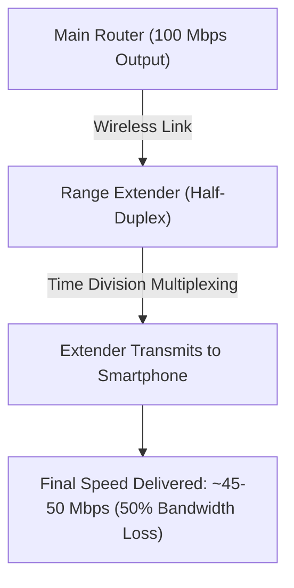

Ghar mein 200Mbps ya 300Mbps ka Fiber Broadband Connection hone ke bawajood jab aap bedroom, balcony ya upper floor par jate hain, toh Wi-Fi signals single bar ho jate hain aur video calls buffering karne lagti hain. Is problem ko **Wi-Fi Dead Zone** kehate hain.

Wi-Fi coverage badhane ke do main tarike hain: **Wi-Fi Range Extender (Repeater)** aur **Mesh Wi-Fi System**.

Boht se log sasta samjh kar ₹1,200 ka Range Extender khareed lete hain aur baad mein speed drops aur frequent disconnection se pareshan hote hain.

Is detailed guide mein hum samjhenge ki **Mesh Wi-Fi vs Range Extender mein kya technical differences hain aur aapke ghar ke layout ke liye kaun sa sahi rahega.**

---

## 📊 Technical Comparison: Mesh Wi-Fi vs Range Extender

| Parameter | Traditional Wi-Fi Range Extender | Mesh Wi-Fi System (TP-Link Deco / Netgear Orbi) |
| :--- | :--- | :--- |
| **Network Name (SSID)** | 2 Separate SSIDs (`Home_WiFi` & `Home_WiFi_EXT`) | Single Unified Network Name (`Home_WiFi`) |
| **Roaming Experience** | Manual Reconnect (Phone purane weak signal ko pakde rehta hai) | 802.11k/v/r Seamless Auto-Switching |
| **Bandwidth & Speed Loss** | 30% - 50% Speed Reduction | Full Bandwidth Preservation (Dedicated Backhaul) |
| **Network Management** | Individual Web Portal Configuration | Centralized Mobile App Management |
| **Setup Cost** | Budget Friendly (₹1,200 - ₹2,500) | Mid-to-High Range (₹4,500 - ₹15,000) |
| **Best Suited For** | 1-2 Room Apartments (Single Dead Spot) | Multi-story Houses, Large Apartments (3BHK/4BHK) |

---

## ⚡ Wi-Fi Extender Speed Drop Ka Technical Reason

Standard Range Extender router ke wireless signal ko catch karke aage repeat karta hai. Kyunki extender ke paas single transmitter antenna hota hai:
1. Time-slot 1 mein woh main router se data receive karta hai.
2. Time-slot 2 mein woh wahi data aapke mobile ko bhejta hai.

Is **Half-Duplex Time Division** ki wajah se extender ke dwara milne wali internet speed flat 50% drop ho jaati hai.

---

## 🌐 Mesh Wi-Fi Seamless Roaming Kaise Kaam Karta Hai?

Mesh System mein 2 ya 3 identical satellite nodes hote hain jo poore ghar mein ek mesh grid bana dete hain:
- **Dedicated Wireless Backhaul:** Tri-band Mesh systems (2.4GHz + 5GHz-1 + 5GHz-2) mein ek 5GHz frequency band sirf nodes ke beech internal data transfer ke liye reserve rehti hai. Isse aapko balcony mein bhi full 200Mbps speed milti hai.
- **802.11r Fast BSS Transition:** Jab aap ground floor se 1st floor par jate hain, toh mesh system 10 milliseconds ke andar aapki connection ko nearest node par handoff kar deta hai bina WhatsApp call drop hue.

---

## 💡 Buyer Decision Guide: Aapko Kya Kharidna Chahiye?

### 1. Wi-Fi Range Extender Kharidein Agar:
- Aapka ghar **1BHK ya 2BHK** apartment hai.
- Sirf ek specific corner ya balcony mein signal weak aata hai.
- Aapka internet plan **50Mbps se kam** hai aur budget tight (under ₹2,000) hai.

### 2. Mesh Wi-Fi System Kharidein Agar:
- Aapka ghar **3BHK+, Duplex, ya Multi-Story House** hai.
- Aapke ghar mein 15+ smart home devices, Smart TVs aur laptops connected rehte hain.
- Aap 100Mbps - 1Gbps Fiber Broadband plan use karte hain aur ghar ke har kone mein full speed chahte hain.

---

### 🔗 Zaroori Related Articles:
* 📌 **5G Speed Comparison:** Mobile 5G vs Home Broadband ke liye [Jio 5G vs Airtel 5G Comparison](/blog/jio-5g-vs-airtel-5g-speed-coverage-comparison-2026/) padhein.
* 📌 **AirFiber vs Fiber:** Broadband connection guide ke liye [Jio AirFiber vs Airtel Xstream Guide](/blog/jio-airfiber-vs-airtel-xstream-hindi-2026/) check karein.
