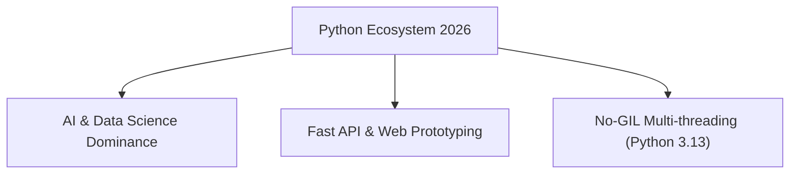

Software Engineering aur Artificial Intelligence ecosystem mein 2026 sabse exciting phase mein hai. Ek taraf **Python** apne massive Machine Learning libraries (PyTorch, TensorFlow, Hugging Face) aur simple readability ke sath data science ki ruling language bani hui hai.

Doosri taraf, **Rust** pichle 8 saalon se Stack Overflow Developer Survey mein **"Most Loved Language"** ka crown jeet kar high-performance microservices, web servers, compiler tooling (jaise SWC, Turbopack, Ruff) aur AI inference engine scale karne mein industry standard ban chuki hai.

Is detailed technical comparison mein hum samjhenge ki **Python vs Rust mein kya differences hain, CPU/Memory benchmarks kya hain, aur aapke career ke liye 2026 mein kaun sa chuna jaye.**

---

## 📊 Deep Technical Comparison: Python vs Rust (2026)

| Parameter | Python (3.13+) | Rust (Edition 2024/2026) |
| :--- | :--- | :--- |
| **Execution Model** | Interpreted / JIT (CPython / PyPy) | Compiled directly to Native Machine Code (LLVM) |
| **Memory Management** | Garbage Collection (Ref Counting + GC) | Ownership & Borrow Checker (Zero-Cost Abstractions) |
| **Concurrency & Parallelism** | Asyncio / Free-Threaded No-GIL Mode | Tokio / Async-std (Safe Data-Race Free Threads) |
| **Execution Speed** | Moderate (Scripting speed) | Blazing Fast (C/C++ Level Performance) |
| **Type Safety** | Dynamic with Optional Type Hints | Strict Compile-Time Static Typing |
| **Best Used For** | AI Prototyping, Data Science, Fast MVP Web APIs | High-Throughput Microservices, CLI Tools, Systems, AI Engines |

---

## 🚀 Key Advantages of Python in 2026



1. **Rapid Development Speed:** Python ka clean syntax developer velocity 3x fast kar deta hai. MVP (Minimum Viable Product) jaldi build hota hai.
2. **AI & ML Ecosystem Monopoly:** OpenAI, LangChain, LlamaIndex aur PyTorch ke sabhi major SDKs Python-first design kiye jate hain.
3. **Python 3.13 Free-Threaded Execution:** GIL (Global Interpreter Lock) disable hone se Multi-core processors par true parallel threads execute hote hain.

---

## ⚡ Key Advantages of Rust in 2026

1. **Zero Garbage Collection Overhead:** Rust mein GC pauses nahi hote. Memory allocations compile time par `Ownership` rules se deterministic manage hoti hain.
2. **Memory Safety Without GC:** Buffer overflows, dangling pointers aur use-after-free bugs compile time par hi catch ho jate hain.
3. **Next-Gen Developer Tooling:** Modern JavaScript/Python tools (Ruff, Rolldown, Turbopack, Biome) ko C++ ke bajaye Rust mein rewrite kiya gaya hai jisse build times 10x-100x fast ho gaye hain.

---

## 🤝 The Hybrid Powerhouse: Python + Rust (PyO3 Engine)

Industry mein ab Python vs Rust ke bajaye **Python WITH Rust** ka trend chal raha hai. Heavy mathematical computations aur file parsing ko Rust mein PyO3 se Module bana diya jata hai aur consumer API ko Python FastAPI se expose kiya jata hai:

```rust
// Rust function compiled via PyO3 for Python
use pyo3::prelude::*;

#[pyfunction]
fn fast_fibonacci(n: u64) -> PyResult<u64> {
    let mut a = 0;
    let mut b = 1;
    for _ in 0..n {
        let temp = a;
        a = b;
        b = temp + b;
    }
    Ok(a)
}

#[pymodule]
fn rust_engine(_py: Python, m: &PyModule) -> PyResult<()> {
    m.add_function(wrap_pyfunction!(fast_fibonacci, m)?)?;
    Ok(())
}
```

---

## 🎯 Final Career Decision Roadmap: 2026 Mein Kya Sikhein?

- **Python Chunein Agar:** Aap Data Science, AI Engineering, Machine Learning Research, Financial Automation, ya Rapid Web Development (FastAPI, Django) mein career banana chahte hain.
- **Rust Chunein Agar:** Aap Systems Engineering, Cloud Infrastructure, DevOps/Kubernetes Tooling, High-Frequency Trading (HFT), ya Compiler Engineering mein specialization chahte hain.
- **Pro Recommendation:** Beginners pehle **Python + TypeScript** master karein. Uske baad Systems Performance & Microservices optimize karne ke liye **Rust** add karein.

---

### 🔗 Zaroori Related Articles:
* 📌 **Python Learning Guide:** Python basics se shuru karne ke liye hamara [Python Kaise Sikhe Guide](/blog/python-kaise-sikhe-beginners/) padhein.
* 📌 **DevOps & Backend Setup:** Backend containerization ke liye [Docker Beginners Guide in Hindi](/blog/docker-beginners-guide-hindi-web-development/) check karein.
