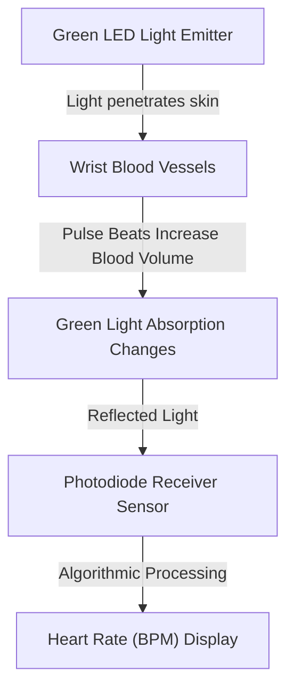

Aaj kal har doosre vyakti ke haath mein Smartwatch ya Fitness Band dikhai deta hai. Companies advertisements mein **"24/7 Continuous Heart Rate Tracking", "SpO2 Blood Oxygen Monitoring", "ECG Heart Rhythm Test", aur "Stress Tracking"** jaise features highlight karti hain.

Lekin kya aapne kabhi socha hai ki aapke kalai (wrist) par lagi ₹1,500 se ₹50,000 ki Smartwatch hospital ke medical-grade equipment ke mukable kitni accurate hoti hai?

Is article mein hum PPG Optical Sensor Technology ka **Reality Check** karenge, **Medical Equipment vs Smartwatch comparison** dekhenge, aur sarakari/medical guidelines samjhenge.

> ⚠️ **Medical Disclaimer:** Smartwatches aur Fitness Trackers consumer wellness gadgets hain. Inhe kisi bhi bimari, heart condition, ya oxygen failure ke diagnosis ya medical treatment ke liye substitute na banayein.

---

## 📊 Medical-Grade Equipment vs Consumer Smartwatch Comparison

| Metric | Medical Equipment (Hospital Monitor / Pulse Oximeter) | Premium Smartwatch (Apple Watch / Galaxy Watch) | Budget Smartwatch (Under ₹3,000 Segment) |
| :--- | :--- | :--- | :--- |
| **Technology Used** | Transmissive Red & Infrared Light (Fingertip) | Reflective PPG Green/Red LED + Single-Lead ECG | Basic Reflective Green LED Sensor |
| **SpO2 Accuracy Range** | ±1% to ±2% (Clinical Grade Verification) | ±2% to ±4% (Rest Condition) | ±5% to ±10% (High Variance) |
| **Heart Rate Accuracy** | 12-Lead ECG / Chest Strap (Chest Electrical Signal) | Optical PPG + Single-Lead ECG (Rest & Exercise) | Optical PPG (Rest Par Reliable, Gym Motion Par Inaccurate) |
| **Motion Artifact Impact** | Minimal (Finger Clip Fixed Placement) | Software Algorithmic Filtering | High Errors during running/arm swinging |

---

## 🔬 Smartwatch Sensors Kaise Kaam Karte Hain? (PPG Mechanism)

Smartwatch ke pichhe jo hara (green) ya laal (red) parkash chamakta hai, use **Photoplethysmography (PPG)** kehate hain.
- **Heart Rate (Green Light):** Blood red color ka hota hai jo green light ko absorb karta hai. Jab heart beat karta hai, wrist arteries mein blood volume badhta hai. Smartwatch photodiode light absorption changes ko count karke Beats Per Minute (BPM) nikalta hai.
- **SpO2 Blood Oxygen (Red & Infrared Light):** Oxygenated blood Infrared light absorb karta hai aur Deoxygenated blood Red light. Sensor dono lights ke reflection ratio ko analyze karke oxygen percentage (95%-100%) estimate karta hai.

---

## 🚫 Smartwatch Readings Mein Errors Ke Top 4 Kaaran

1. **Arm Motion (Motion Artifacts):** Running, gymming ya cycling karte waqt smartwatch kalai par hilti hai jisse photodiode ko incorrect light reflection milti hai.
2. **Wrist Placement & Tightness:** Agar strap dheela (loose) hai, toh bahar ki ambient room light sensor ke andar ghus jati hai aur false reading deti hai.
3. **Tattoos & Melanin Absorption:** Heavy wrist tattoos ke dark ink pigments green light ko block kar dete hain jisse sensor error throw karta hai.
4. **Poor Peripheral Blood Circulation:** Thand (winter season) mein ya low blood pressure mein finger/wrist capillaries constrict ho jati hain jisse PPG signal weak ho jata hai.

---

## 💡 Smartwatch Sensors Ka Sahi Upayog Kaise Karein?

- **Rest Position Mein Measure Karein:** SpO2 ya Heart Rate check karte waqt 1 minute shant baith kar haath ko table par rakh kar stillness maintain karein.
- **Strap Tightness Check Karein:** Watch ko kalai ki bone se 1-finger width upar pehnein aur strap ko snug (fit) rakhein.
- **Emergency Signs Ko Ignore Na Karein:** Agar smartwatch SpO2 90% dikha rahi hai LEKIN aapko koi saans lene mein dikkat nahi hai -> pehle medical pulse oximeter se double-check karein. Agar sach mein difficulty hai, toh instant doctor se contact karein.

---

## 🩺 PPG Optical Sensor Kaise Kaam Karta Hai?

Smartwatch ke piche lagi green aur red LEDs ko **Photoplethysmography (PPG)** sensor kaha jata hai:
* Green LEDs blood vessels par light flash karti hain.
* Dil ke har pump ke sath blood volume change hota hai aur light absorption badalti hai.
* Smartwatch ke algorithms is light reflection pattern se aapka Pulse (BPM) calculate karte hain.

### Consumer Smartwatch Kahan Galat Ho Jaati Hai?
1. **Skin Tone & Arm Hair:** Darker skin pigments aur body hair light reflection ko distort karte hain, jisse readings 5-10% fluctuate ho sakti hain.
2. **Wrist Movement & Loose Fit:** Daudte waqt ya gym mein agar strap thoda bhi loose hai, toh ambient light enter kar jaati hai jisse fake spikes aate hain.
3. **Medical Grade Pulse Oximeter Difference:** Hospital ka finger probe blood vessels ko dono sides se clip karke dual-wavelength light scan karta hai, jo wrist sensors se bohot zyada calibrated hota hai.

---

## 💡 Health Tracking Ka Safe Rule
Smartwatch ko sirf **"Lifestyle Trend Tracker"** ki tarah use karein (jaise: kya pichle hafte ke mukable mera resting heart rate badh raha hai?). Kisi bhi medical decision, dava lene ya emergency diagnosis ke liye hamesha certified clinical medical equipment ka hi bharosa karein.

### 🔗 Zaroori Related Articles:
* 📌 **Smartwatch Buying Guide:** Top smartwatch selection ke liye hamara [Best Smartwatches Under 5000 Guide](/blog/best-smartwatches-under-5000/) padhein.
* 📌 **Smartphone Battery Tips:** Battery health maintain karne ke liye [Phone Battery Life Hacks](/blog/phone-battery-life-tips-hindi/) check karein.
