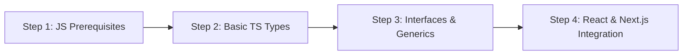

Agar aap 2026 mein Web Development, React, Next.js ya Full-Stack Node.js ecosystem mein job ya freelancing ke liye try kar rahe hain, toh sirf Vanilla JavaScript aana ab kaafi nahi hai. Aaj lagbhag har badi tech company aur open-source project JavaScript ke bajaye **TypeScript (TS)** par shift ho chuka hai.

TypeScript Microsoft dwara develop kiya gaya ek **Strongly Typed Programming Language** hai jo JavaScript par build hota hai.

Is comprehensive guide mein hum simple Hinglish mein samjhenge ki **TypeScript kya hai, JavaScript se kaise alag hai, aur 2026 mein ise step-by-step kaise sikhein.**

---

## ⚡ JavaScript vs TypeScript (Quick Tech Comparison)

| Feature | Vanilla JavaScript | TypeScript |
| :--- | :--- | :--- |
| **Type System** | Dynamic Typing (Runtime par type check) | Static Typing (Compile time par type check) |
| **Error Detection** | Runtime Errors (Browser mein app crash hone par pata chalta hai) | Compile-time Errors (VS Code editor mein hi red squiggly line dikhti hai) |
| **Tooling & Autocomplete** | Basic IntelliSense | Rich Autocomplete, Refactoring & Inline Documentation |
| **Learning Curve** | Easy (Beginner Friendly) | Moderate (Types aur Interfaces sikhna padta hai) |
| **Browser Execution** | Direct Browser Execution | Needs Compilation (`tsc`) to JavaScript |

---

## 🎯 Beginners Ke Liye 4-Step TypeScript Roadmap (2026)



---

### Step 1: Basic Primitive Types Samajhna

TypeScript mein sabse pehle variable types define karna seekhein:

```typescript
// Explicit Type Definitions
let developerName: string = "Aayush Kumar";
let yearsOfExperience: number = 3;
let isFullStack: boolean = true;
let skillsList: string[] = ["React", "Next.js", "TypeScript", "Node.js"];

// Function with Parameter & Return Types
function calculateGST(amount: number, taxRate: number): number {
  return amount + (amount * taxRate) / 100;
}
```

---

### Step 2: Interface vs Type Alias (Object Typing)

TypeScript mein Objects aur Component Props ke structure ko define karne ke liye `interface` aur `type` ka use hota hai.

```typescript
// 1. Interface Definition (Best for OOP & Component Props)
interface UserProfile {
  id: number;
  username: string;
  email: string;
  bio?: string; // Optional Property (?)
}

const user1: UserProfile = {
  id: 101,
  username: "aayush7455",
  email: "contact@techverseblogs.in"
};

// 2. Type Alias Definition (Best for Union Types)
type Status = "pending" | "approved" | "rejected";
let currentOrderStatus: Status = "approved";
```

---

### Step 3: TypeScript Setup & TSConfig Configuration

Apne local machine par TypeScript setup karne ke liye Node.js installed hona chahiye.

#### Terminal Commands:
```bash
# 1. Global TypeScript Compiler Install Karein
npm install -g typescript

# 2. Project Folder Banayein Aur Initialize Karein
mkdir ts-demo && cd ts-demo
npm init -y
npm install --save-dev typescript @types/node

# 3. TSConfig File Generate Karein
npx tsc --init
```

#### Essential `tsconfig.json` Recommended Options:
```json
{
  "compilerOptions": {
    "target": "ES2022",
    "module": "NodeNext",
    "strict": true,
    "noImplicitAny": true,
    "skipLibCheck": true
  }
}
```

---

### Step 4: React 19 / Next.js 15 Mein TypeScript Integration

React Components mein Props type safety ke liye TS ki zaroorat hoti hai:

```tsx
// React Component with TypeScript Props
interface ArticleCardProps {
  title: string;
  slug: string;
  viewsCount: number;
  isFeatured?: boolean;
}

export default function ArticleCard({ title, slug, viewsCount, isFeatured = false }: ArticleCardProps) {
  return (
    <div className={`card ${isFeatured ? 'border-blue-500' : ''}`}>
      <h3>{title}</h3>
      <p>Views: {viewsCount}</p>
      <a href={`/blog/${slug}/`}>Read More</a>
    </div>
  );
}
```

---

## 💡 Top 3 Common Errors & Fixes for Beginners

1. **`Type 'string' is not assignable to type 'number'`**: Variable mein wrong data type pass ho raha hai. Type definition match karein.
2. **`Property 'X' does not exist on type 'Y'`**: Interface mein property missing hai ya spelling mistake hai. Optional `?` check karein.
3. **`Object is possibly 'undefined'`**: Access karne se pehle Optional Chaining (`user?.profile?.avatar`) ka use karein.

---

### 🔗 Zaroori Related Articles:
* 📌 **Full Stack Roadmap:** Developer banne ki poori guide ke liye hamara [Full Stack Developer Roadmap 2026](/blog/full-stack-developer-kaise-bane-2026-roadmap/) padhein.
* 📌 **React vs Next.js:** Frontend framework selection ke liye [React 19 vs Next.js 15 Guide](/blog/react-19-vs-nextjs-15-hindi-comparison-roadmap/) check karein.
