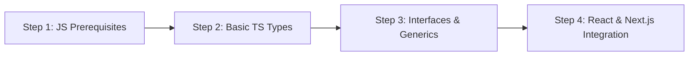

Agar aap 2026 mein Web Development, React, Next.js ya Full-Stack Node.js ecosystem mein job ya freelancing ke liye try kar rahe hain, toh sirf Vanilla JavaScript aana ab kaafi nahi hai. Aaj lagbhag har badi tech company aur open-source project JavaScript ke bajaye **TypeScript (TS)** par shift ho chuka hai.

TypeScript Microsoft dwara develop kiya gaya ek **Strongly Typed Programming Language** hai jo JavaScript par build hota hai.

Is comprehensive guide mein hum simple Hinglish mein samjhenge ki **TypeScript kya hai, JavaScript se kaise alag hai, aur 2026 mein ise step-by-step kaise sikhein.**

---

## ⚡ JavaScript vs TypeScript (Quick Tech Comparison)

| Feature | Vanilla JavaScript | TypeScript |
| :--- | :--- | :--- |
| **Type System** | Dynamic Typing (Runtime par type check) | Static Typing (Compile time par type check) |
| **Error Detection** | Runtime Errors (Browser mein app crash hone par pata chalta hai) | Compile-time Errors (VS Code editor mein hi red squiggly line dikhti hai) |
| **Tooling & Autocomplete** | Basic IntelliSense | Rich Autocomplete, Refactoring & Inline Documentation |
| **Learning Curve** | Easy (Beginner Friendly) | Moderate (Types aur Interfaces sikhna padta hai) |
| **Browser Execution** | Direct Browser Execution | Needs Compilation (`tsc`) to JavaScript |

---

## 🎯 Beginners Ke Liye 4-Step TypeScript Roadmap (2026)



---

### Step 1: Basic Primitive Types Samajhna

TypeScript mein sabse pehle variable types define karna seekhein:

```typescript
// Explicit Type Definitions
let developerName: string = "Aayush Kumar";
let yearsOfExperience: number = 3;
let isFullStack: boolean = true;
let skillsList: string[] = ["React", "Next.js", "TypeScript", "Node.js"];

// Function with Parameter & Return Types
function calculateGST(amount: number, taxRate: number): number {
  return amount + (amount * taxRate) / 100;
}
```

---

### Step 2: Interface vs Type Alias (Object Typing)

TypeScript mein Objects aur Component Props ke structure ko define karne ke liye `interface` aur `type` ka use hota hai.

```typescript
// 1. Interface Definition (Best for OOP & Component Props)
interface UserProfile {
  id: number;
  username: string;
  email: string;
  bio?: string; // Optional Property (?)
}

const user1: UserProfile = {
  id: 101,
  username: "aayush7455",
  email: "contact@techverseblogs.in"
};

// 2. Type Alias Definition (Best for Union Types)
type Status = "pending" | "approved" | "rejected";
let currentOrderStatus: Status = "approved";
```

---

### Step 3: TypeScript Setup & TSConfig Configuration

Apne local machine par TypeScript setup karne ke liye Node.js installed hona chahiye.

#### Terminal Commands:
```bash
# 1. Global TypeScript Compiler Install Karein
npm install -g typescript

# 2. Project Folder Banayein Aur Initialize Karein
mkdir ts-demo && cd ts-demo
npm init -y
npm install --save-dev typescript @types/node

# 3. TSConfig File Generate Karein
npx tsc --init
```

#### Essential `tsconfig.json` Recommended Options:
```json
{
  "compilerOptions": {
    "target": "ES2022",
    "module": "NodeNext",
    "strict": true,
    "noImplicitAny": true,
    "skipLibCheck": true
  }
}
```

---

### Step 4: React 19 / Next.js 15 Mein TypeScript Integration

React Components mein Props type safety ke liye TS ki zaroorat hoti hai:

```tsx
// React Component with TypeScript Props
interface ArticleCardProps {
  title: string;
  slug: string;
  viewsCount: number;
  isFeatured?: boolean;
}

export default function ArticleCard({ title, slug, viewsCount, isFeatured = false }: ArticleCardProps) {
  return (
    <div className={`card ${isFeatured ? 'border-blue-500' : ''}`}>
      <h3>{title}</h3>
      <p>Views: {viewsCount}</p>
      <a href={`/blog/${slug}/`}>Read More</a>
    </div>
  );
}
```

---

## 💡 Top 3 Common Errors & Fixes for Beginners

1. **`Type 'string' is not assignable to type 'number'`**: Variable mein wrong data type pass ho raha hai. Type definition match karein.
2. **`Property 'X' does not exist on type 'Y'`**: Interface mein property missing hai ya spelling mistake hai. Optional `?` check karein.
3. **`Object is possibly 'undefined'`**: Access karne se pehle Optional Chaining (`user?.profile?.avatar`) ka use karein.

---

## 🛠️ TypeScript Ke Top 3 Core Concepts Jo Har Beginner Ko Master Karne Hain

1. **Interfaces vs Type Aliases:**
   ```typescript
   // Interface: Object shapes aur class contracts ke liye best
   interface UserProfile {
     id: number;
     name: string;
     email: string;
     isVerified?: boolean; // Optional property
   }

   // Type Alias: Unions aur Primitives ke liye best
   type PaymentStatus = 'pending' | 'success' | 'failed';
   ```

2. **Generics (Reusable Component Functions):**
   Generics ke zariye aap aisi reusable functions bana sakte hain jo dynamic data types ke sath safe type checking provide karti hain:
   ```typescript
   function getFirstElement<T>(arr: T[]): T | undefined {
     return arr[0];
   }
   ```

3. **Strict Null Checks:**
   Apne `tsconfig.json` mein hamesha `"strict": true` rakhein. Isse production mein aane wale 90% `TypeError: Cannot read properties of undefined` bugs compile time par hi pakad mein aa jaate hain.


### 🔗 Zaroori Related Articles:
* 📌 **Full Stack Roadmap:** Developer banne ki poori guide ke liye hamara [Full Stack Developer Roadmap 2026](/blog/full-stack-developer-kaise-bane-2026-roadmap/) padhein.
* 📌 **React vs Next.js:** Frontend framework selection ke liye [React 19 vs Next.js 15 Guide](/blog/react-19-vs-nextjs-15-hindi-comparison-roadmap/) check karein.

## TypeScript Kyun Seekhna Chahiye? (Real Benefits)

JavaScript developers ke liye TypeScript sirf ek fancy add-on nahi hai — ye actually aapki productivity **2x** kar deta hai. Yahan practical reasons hain:

**1. Compile-Time Error Detection**
JavaScript me bugs runtime par milte hain — jab user already problem face kar chuka hota hai. TypeScript bugs ko **code likhte waqt hi** pakad leta hai. VS Code mein red underline dekhkar instantly fix kar sakte ho.

**2. Intelligent Autocomplete (IntelliSense)**
TypeScript ke saath VS Code itna smart ho jaata hai ki wo aapko function ke saare parameters, return types, aur available methods suggest karta hai. 40-50% faster coding hoti hai.

**3. Team Collaboration Made Easy**
Jab aap 3-4 log ek codebase pe kaam karte ho, TypeScript ensure karta hai ki koi bhi galat type ka data pass na kare. Production bugs drastically kam ho jaate hain.

## TypeScript Setup — Step by Step (2026)

```bash
# Node.js installed hona chahiye
node --version  # v18+ recommended

# TypeScript globally install karo
npm install -g typescript

# Version check
tsc --version

# Nayi project banao
mkdir my-ts-project && cd my-ts-project
npm init -y

# TypeScript dependencies
npm install -D typescript @types/node ts-node

# tsconfig.json generate karo
npx tsc --init
```

**tsconfig.json ke important settings:**
```json
{
  "compilerOptions": {
    "target": "ES2020",
    "module": "commonjs",
    "strict": true,
    "outDir": "./dist",
    "rootDir": "./src"
  }
}
```

## TypeScript ke Core Concepts (Practical Examples)

### 1. Basic Types — Ek Baar Me Samjho

```typescript
// JavaScript (no type safety)
let name = "Rahul";
name = 42;  // No error! Bug aa sakta hai

// TypeScript (type safe)
let userName: string = "Rahul";
userName = 42;  // ❌ Error: Type 'number' is not assignable to type 'string'

// Common types
let age: number = 25;
let isLoggedIn: boolean = true;
let skills: string[] = ["React", "Node.js", "TypeScript"];
let tuple: [string, number] = ["Rahul", 25];
```

### 2. Interface vs Type — Confusion Khatam Karo

| Feature | Interface | Type |
|---------|-----------|------|
| Object shapes | ✅ Best for this | ✅ Works too |
| Primitives | ❌ No | ✅ Yes |
| Union types | ❌ No | ✅ Yes |
| Extension | extends keyword | & operator |
| Declaration merging | ✅ Yes | ❌ No |

```typescript
// Interface (prefer for objects)
interface User {
  id: number;
  name: string;
  email: string;
  role?: "admin" | "user";  // Optional property
}

// Type (prefer for unions/complex types)
type Status = "active" | "inactive" | "pending";
type ID = string | number;
```

### 3. Generics — TypeScript Ki Superpower

```typescript
// Bina generics — type safety nahi
function getFirst(arr: any[]) {
  return arr[0];
}

// Generics ke saath — fully type safe
function getFirst<T>(arr: T[]): T {
  return arr[0];
}

const firstNum = getFirst([1, 2, 3]);     // Type: number
const firstStr = getFirst(["a", "b"]);    // Type: string
```

## 6 Month TypeScript Roadmap

| Month | Topics | Projects |
|-------|--------|---------|
| Month 1 | Types, Interfaces, Type Assertions | Todo App |
| Month 2 | Generics, Utility Types, Enums | API Client |
| Month 3 | Classes, Access Modifiers, Decorators | OOP Project |
| Month 4 | TypeScript + React (TSX) | React Dashboard |
| Month 5 | TypeScript + Node.js + Express | REST API |
| Month 6 | Advanced Patterns, Testing with Jest | Full Stack App |

## Free Resources (Best for Indians)

- **TypeScript Official Docs** — typescriptlang.org/docs (English, free)
- **The Odin Project** — TypeScript module (free, project-based)
- **Fireship.io YouTube** — 100 seconds TypeScript (quick concepts)
- **TypeScript Deep Dive Book** — basarat.gitbook.io (free online)
- **Execute Program** — Interactive TypeScript course (freemium)

## TypeScript Jobs India Mein — Kitni Salary?

TypeScript skills ab almost every React/Node job requirement mein hai:

| Role | Experience | Average Salary (2026) |
|------|-----------|----------------------|
| Junior Frontend Dev | 0-2 years | ₹4-8 LPA |
| Mid Frontend Dev | 2-4 years | ₹10-18 LPA |
| Senior Full Stack | 4+ years | ₹20-35 LPA |
| Tech Lead | 6+ years | ₹35-60 LPA |

**Pro Tip:** TypeScript + React + Node.js combo aapko top 10% developers mein dalta hai India mein.

## TypeScript Debugging Aur Migration Strategies

Jab aap kisi existing JavaScript project ko TypeScript mein migrate karte hain, toh ek saath saari files convert karne ki galti kabhi mat karein:

### Step-by-Step Incremental Migration:
1. **AllowJS Mode Enable Karein:** `tsconfig.json` mein `"allowJs": true` rakhein taaki purani `.js` files aur nayi `.ts` files ek saath peacefully chal sakein.
2. **Strict Mode Gradually On Karein:** Shuruwat mein utility functions aur data models ko type annotate karein, phir dhire-dhire components aur API handlers ko convert karein.
3. **'any' Type Ka Overuse Na Karein:** Agar aap har jagah `let data: any` likh rahe hain, toh TypeScript ka koi benefit nahi hoga. Hamesha accurate interfaces define karein ya safe alternative ke tor par `unknown` use karein.
